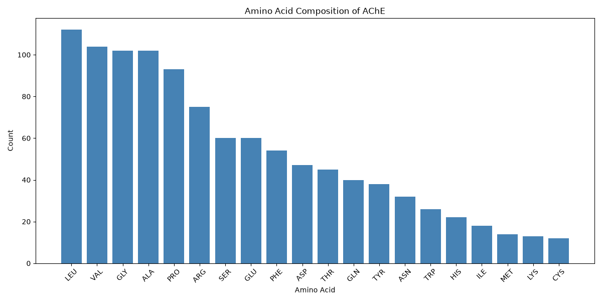
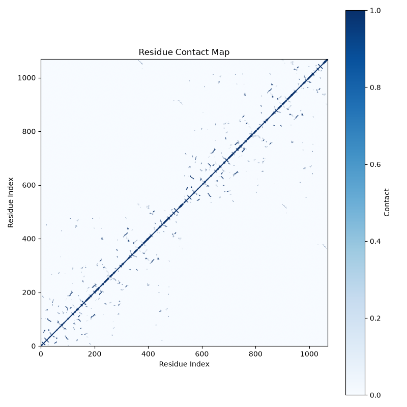

# 🧬 ProteinViz


A Python-based structural bioinformatics toolkit for analyzing protein structures from the Protein Data Bank (PDB).

---

## 📖 Overview

ProteinViz demonstrates how Biopython can be used to parse, analyze, and visualize protein structures.

The project performs structural analysis on Acetylcholinesterase (PDB ID: 4M0E) and generates reports, CSV files, and scientific visualizations.

---

## 🔄 Workflow

```text
PDB File
    │
    ▼
Protein Parsing
    │
    ▼
Chain Analysis
    │
    ▼
Composition Analysis
    │
    ▼
Visualization
    │
    ▼
Reports & CSV Files

---
## ✨ Features

- Parse PDB protein structures
- Analyze protein chains
- Count residues and atoms
- Amino acid composition analysis
- Amino acid classification
- Amino acid percentage analysis
- Molecular weight estimation
- Protein centroid calculation
- Neighbor residue analysis
- Residue contact map generation
- CSV and text report generation
- Scientific visualizations using Matplotlib

---

## 📂 Project Structure

```text
ProteinViz/
├── data/
├── figures/
├── notebooks/
├── results/
├── scripts/
├── README.md
├── requirements.txt
└── LICENSE
```


---

### 3. Project Statistics

Place this **after Project Structure**.

```markdown
## 📈 Project Statistics

- Python scripts: 15
- Figures generated: 4
- CSV reports: 4
- Text reports: 4
- Jupyter Notebook included: ✅

---

## 🛠 Technologies Used

| Library | Purpose |
|---------|---------|
| Python | Core programming language |
| Biopython | Parse and analyze PDB structures |
| Pandas | Data analysis and CSV generation |
| NumPy | Numerical computations |
| Matplotlib | Scientific visualizations |
| Jupyter Notebook | Interactive analysis |
| Git & GitHub | Version control and collaboration |
---

## 📊 Generated Outputs

### Reports

- Protein summary
- Chain summary
- Molecular weight
- Centroid report

### CSV Files

- Amino acid composition
- Amino acid percentages
- Amino acid classes
- Chain summary

### Figures

- Amino acid composition
- Amino acid classification
- Chain summary
- Contact map

## Sample Output

### Amino Acid Composition



### Contact Map


---

## 🚀 Installation

```bash
git clone <repository-url>
cd ProteinViz
python3 -m pip install -r requirements.txt
```

---

## ▶️ Usage

Run any analysis script, for example:

```bash
python3 scripts/protein_parser.py
```

or

```bash
python3 scripts/contact_map.py
```

---

## 🔮 Future Improvements

- DSSP-based secondary structure analysis
- Interactive 3D visualization
- Support for multiple PDB files
- Automated analysis pipeline

---
## 🙏 Acknowledgements

- Protein Data Bank (PDB) for providing protein structure data.
- Biopython developers for the structural biology toolkit.
- Matplotlib and Pandas communities for visualization and data analysis libraries.

## 📄 License

This project is licensed under the MIT License.